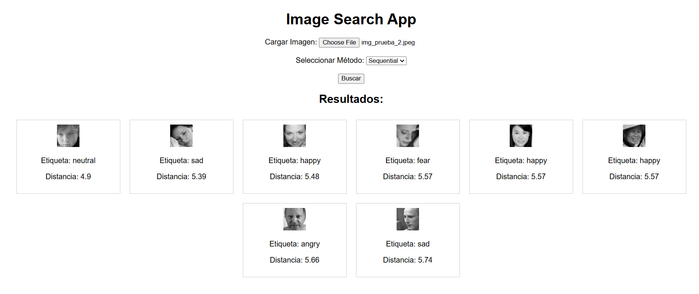
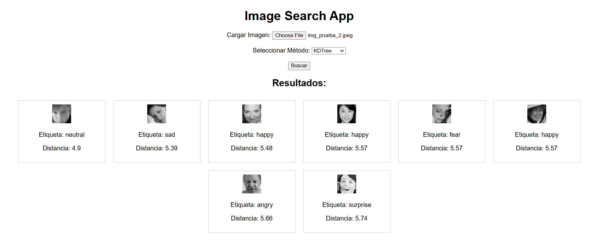

# Parte 3 Proyecto BD2
# Busqueda de imagenes con índice multidimensional

---

## **Introducción**

### **Objetivo del proyecto**
El objetivo de este proyecto es implementar un sistema de búsqueda por similitud basado en imágenes, utilizando técnicas de indexación multidimensional. A través de la extracción de descriptores locales y la creación de un vocabulario visual, las imágenes se indexan para realizar búsquedas eficientes, incluso en grandes conjuntos de datos. Los resultados incluyen imágenes similares junto con sus etiquetas y distancias a la consulta original.

---

## **Descripción del dominio de datos y la importancia de la indexación**

### **Dominio de datos**
El conjunto de datos consiste en imágenes divididas en categorías que representan diferentes expresiones faciales: *surprise, sad, neutral, happy, fear, disgust, angry*. Cada categoría contiene imágenes almacenadas en subcarpetas.

### **Importancia de la indexación**
Cuando el tamaño del conjunto de datos aumenta, realizar búsquedas secuenciales (comparación directa con todas las imágenes) se vuelve computacionalmente costoso. Para superar este desafío:
- Se utiliza un índice multidimensional para organizar las imágenes en el espacio de características de manera eficiente.
- Esto permite búsquedas más rápidas, tanto en tareas de K-Nearest Neighbors (KNN) como en búsquedas por rango.

---

## **Backend: Índice Multidimensional**

### **Técnica de indexación y librerías utilizadas**
Para implementar el índice multidimensional, utilizamos las siguientes técnicas y librerías:
1. **Bag of Visual Words (BoVW)**: 
   - Las imágenes se representan como histogramas de palabras visuales.
   - Para ello, se extraen descriptores SIFT de las imágenes y se agrupan en un vocabulario visual utilizando *K-Means*.
2. **Scikit-learn**:
   - Para el algoritmo *K-Means*, que agrupa los descriptores en clusters, formando el vocabulario visual.
   - Se utiliza un árbol KD-Tree para crear un índice de búsqueda eficiente en el espacio de características.
3. **OpenCV**:
   - Para la extracción de descriptores SIFT, una técnica que detecta puntos clave y genera representaciones locales de las imágenes.

---

### **KNN Search y Range Search**
#### **KNN Search**
- El **K-Nearest Neighbors (KNN)** se implementa utilizando la estructura de KD-Tree proporcionada por *Scikit-learn*. 
- Dado un histograma de consulta, el índice devuelve las *k* imágenes más cercanas basándose en la métrica de distancia Euclidiana.
- Pasos:
  1. Cargar el índice preprocesado.
  2. Consultar el índice con el histograma de la imagen cargada.
  3. Recuperar las *k* imágenes más cercanas.

#### **Range Search**
- Aunque no se utiliza directamente en este proyecto, el KD-Tree soporta búsquedas por rango, donde se pueden recuperar todas las imágenes dentro de un rango específico de distancia desde la consulta.
- Esto es útil en aplicaciones donde es necesario limitar las imágenes recuperadas a aquellas con alta similitud.

---

#### **Problema**
Llegan a ocurrir problemas cuando el número de dimensiones (características) del espacio aumenta, lo que reduce la efectividad de las técnicas de indexación tradicionales. Algunos efectos incluyen:
- La distancia entre puntos tiende a volverse uniforme.
- Los índices como KD-Tree pierden eficiencia en espacios de alta dimensionalidad.

#### **Mitigación**
- **Reducción de dimensionalidad**:
  - En este proyecto, la dimensionalidad se controla al reducir los descriptores locales a un vocabulario de tamaño fijo mediante *K-Means*.
  - Esto transforma un conjunto de descriptores de alta dimensionalidad en un histograma compacto y manejable.
- **Elección adecuada de métricas**:
  - Se utiliza la distancia Euclidiana para las comparaciones, ya que es adecuada para espacios de características generados por BoVW.
- **Tamaño de vocabulario ajustado**:
  - El tamaño del vocabulario (número de clusters) se ajusta de forma experimental para balancear precisión y eficiencia.

---

## **Estructura del Proyecto**

### **Preprocesamiento**
1. **Carga de imágenes**:
   - Se cargan las imágenes desde subcarpetas organizadas por categorías.
2. **Detectar puntos clave**:
   - SIFT identifica características distintivas en cada imagen, como bordes, esquinas y regiones de alto contraste.
3. **Calcular descriptores**:
   - Para cada punto clave, se genera un descriptor que representa la distribución local de gradientes en la región alrededor del punto.
4. **Construcción del vocabulario visual**:
   - Los descriptores se agrupan con *K-Means* para generar un vocabulario.
5. **Indexación de histogramas**:
   - Se construye un índice KD-Tree con los histogramas BoVW generados.

### **Backend**
El backend está construido en Flask y ofrece las siguientes rutas:
- `/search`: Permite realizar búsquedas con diferentes métodos (Sequential y KD-Tree).
- `/image/<path>`: Sirve las imágenes recuperadas al frontend.

### **Frontend**
- Interfaz web simple en HTML, CSS y JavaScript.
- Permite cargar una imagen y seleccionar el método de búsqueda.
- Muestra los resultados con la imagen, etiqueta y distancia al histograma de consulta.

---

## **Requisitos del Sistema**
**Librerías**:
   - Python >= 3.8
   - OpenCV
   - Scikit-learn
   - Flask
