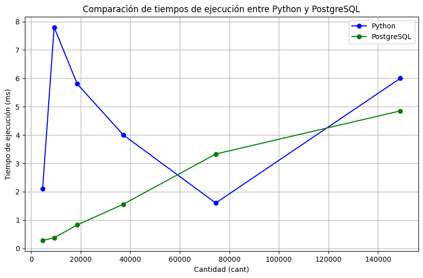

# Proyecto: SPIMI Data Query

## Descripción General
DataFusionDB es un proyecto enfocado en la integración de diferentes modelos de datos y técnicas avanzadas de recuperación de información en una base de datos. El proyecto incluye la implementación de un índice invertido para búsqueda de texto completo y una interfaz web para interactuar con el índice.

## Objetivos
- Desarrollar un índice invertido para realizar búsquedas eficientes en colecciones de texto.
- Implementar la funcionalidad de SPIMI para manejar grandes colecciones de datos en memoria secundaria.
- Crear un frontend interactivo donde los usuarios puedan ingresar consultas textuales, especificar el número de resultados (Top K) y elegir el método de indexación.

## Funcionalidades Implementadas

### Backend
- **Preprocesamiento de Texto**: Se utiliza `nltk` para la tokenización, eliminación de stopwords y stemming.
- **Índice Invertido con TF-IDF**: Implementación de un índice invertido que utiliza TF-IDF para calcular la relevancia de términos en los documentos.
- **SPIMI (Single-Pass In-Memory Indexing)**: Para manejar grandes volúmenes de datos, se dividió el índice en bloques que se almacenan en memoria secundaria, los cuales luego se combinan en un índice final.
- **Almacenamiento en JSON**: El índice invertido se guarda en formato JSON para evitar recalculaciones innecesarias y mejorar la eficiencia en la carga.

**Investigación**
**¿Como realiza PostgreSQL recuperazión de textos?**
1. **Indices de texto**:
PostgreSQL utiliza principalmente 2 tipos de indices para una busqueda de texto:
- **GIN (Generalized Inverted Index)**: Usado para una busqueda exacta de palabras. Al descomponer el texto en tokens, los guarda junto a una lista de documentos en los que aparece, de modo que, al momento de realizarse la busqueda, ya no se tendria que escanear la tabla, ya que se puede ir directamente a la palabra buscada.
- **GiST (Generalized Search Tree)**: Usado para busquedas por similitud (proximidad). Tiene mas libertad que el GIN pero tambien esta mas propenso a errores.

2. **Función de Similitud**:
Como se menciono previamente en GIN, PostgreSQL utiliza un tsvector para almacenar el texto tokenizado.
Se tokeniza tambien la query para obtener tsquery, con la cual se realizara la busqueda de coincidencias en el tsvector.

### Frontend
- **Aplicación Web con Flask**: Se utilizó Flask para crear un servidor web que permite realizar consultas en el índice invertido.
- **Interfaz de Usuario**: Se creó una interfaz en HTML y CSS donde el usuario puede:
  - Ingresar una consulta textual.
  - Especificar el número de documentos a recuperar (Top K).
  - Ver los resultados de la búsqueda con el tiempo de ejecución de cada consulta.
- **Consulta y Recuperación de Resultados**: La aplicación busca en el índice invertido utilizando similitud de coseno y devuelve los documentos más relevantes.

## Estructura de Archivos

- `app.py`: Archivo principal de la aplicación web, que contiene las rutas de Flask y la lógica para realizar consultas.
- `Parte1.py`: Contiene la implementación del índice invertido y el algoritmo SPIMI para el almacenamiento de grandes volúmenes de datos.
- `templates/index.html`: Interfaz de usuario que permite realizar consultas de búsqueda.
- `data.csv`: Archivo CSV de datos original que contiene los documentos a indexar.
- `data_duplicated.csv`: Archivo duplicado de `data.csv` para pruebas con un conjunto de datos más grande.
- `final_inverted_index.json`: Índice invertido almacenado en memoria secundaria en formato JSON.

## Ejecución

1. **Requisitos**: 
   ```bash
   pip install pandas nltk flask


2. ## Preparar el Índice:
- Ejecuta `Parte1.py` para construir y guardar el índice invertido en `final_inverted_index.json`.

3. ## Iniciar la Aplicación:
- Inicia el servidor Flask desde app.py con el comando:
```bash
   python app.py
```
- Ingresa a la dirección creada para acceder a la interfaz de busqueda.


## Experimentación y Análisis de Resultados

### Tabla de Resultados

| Cantidad de Documentos | Tiempo en Python (ms) | Tiempo en PostgreSQL (ms) |
|------------------------|-----------------------|---------------------------|
| 4657                   | 2.1                   | 0.284                     |
| 9314                   | 7.8                   | 0.372                     |
| 18628                  | 5.8                   | 0.828                     |
| 37256                  | 4.0                   | 1.558                     |
| 74512                  | 1.6                   | 3.329                     |
| 149024                 | 6.0                   | 4.850                     |

## Gráfico de Comparación de Tiempos de Ejecución




### Interpretación de los Gráficos

El gráfico compara los tiempos de ejecución entre Python y PostgreSQL a medida que aumenta la cantidad de documentos.
Cabe anotar que en el gráfico, los tiempos de ejecución más largos en Python y PostgreSQL pueden no ser completamente representativos de un escenario con datos únicos y variados, dado que los duplicados pueden estar influyendo en el rendimiento, por lo que no es una evaluación precisa pero ayudan a dar una base para pruebas iniciales de rendimiento.
- **Tendencia en Python**: Se puede observar que el tiempo de ejecución en Python no sigue un patrón lineal. Los tiempos fluctúan, lo cual podría deberse al aumento en el tamaño del conjunto sin necesariamente aumentar la variedad de contenido. Esto llevaria a una menor precisión en el análisis de rendimiento puesto que los tiempos de ejecución estarian reflejando la carga de datos redundantes en lugar de datos únicos.
- **Tendencia en PostgreSQL**: Los tiempos de PostgreSQL muestran una tendencia de crecimiento casi lineal conforme aumenta la cantidad de documentos, lo cual indica un rendimiento más consistente y optimizado para manejar grandes volúmenes de datos.

### Análisis Comparativo

1. **Rendimiento en Cantidades Pequeñas**: Para volúmenes menores (por ejemplo, hasta 4657 documentos), Python y PostgreSQL tienen tiempos de ejecución similares. Sin embargo, PostgreSQL es más rápido en general, incluso en pequeñas cantidades.
  
2. **Rendimiento en Cantidades Grandes**: A medida que aumenta el número de documentos, PostgreSQL mantiene un rendimiento más eficiente y predecible, mientras que Python muestra más variabilidad.

3. **Conclusión**: PostgreSQL es mejor para manejar grandes volúmenes de datos de manera consistente, mientras que Python podría ser adecuado para prototipos o pequeños conjuntos de datos.

